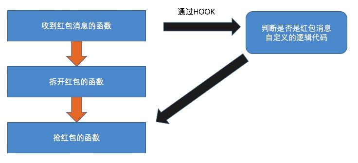

# 009--HOOK原理
## 一、HOOK概述
HOOK(钩子) 其实就是改变程序执行流程的一种技术的统称!
HOOK逻辑图

iOS中HOOK技术的几种方式

### 1、Method Swizzle

   利用OC的Runtime特性，动态改变SEL（方法编号）和IMP（方法实现）的对应关系，达到OC方法调用流程改变的目的。主要用于OC方法。

### 2、fishhook

   它是Facebook提供的一个动态修改链接mach-O文件的工具。利用MachO文件加载原理，通过修改懒加载和非懒加载两个表的指针达到C函数HOOK的目的。

### 3、Cydia Substrate

   Cydia Substrate 原名为 Mobile Substrate ，它的主要作用是针对OC方法、C函数以及函数地址进行HOOK操作。当然它并不是仅仅针对iOS而设计的，安卓一样可以用。官方地址：http://www.cydiasubstrate.com/

Cydia Substrate主要由3部分组成：

* MobileHooker

   MobileHooker顾名思义用于HOOK。它定义一系列的宏和函数，底层调用objc的runtime和fishhook来替换系统或者目标应用的函数.
其中有两个函数:

MSHookMessageEx 主要作用于Objective-C方法
 void MSHookMessageEx(Class class, SEL selector, IMP replacement, IMP result)
MSHookFunction 主要作用于C和C++函数
 void MSHookFunction(voidfunction,void* replacement,void** p_original)
Logos语法的%hook 就是对此函数做了一层封装
MobileLoader

   MobileLoader用于加载第三方dylib在运行的应用程序中。启动时MobileLoader会根据规则把指定目录的第三方的动态库加载进去，第三方的动态库也就是我们写的破解程序.

* safe mode

   因为APP程序质量参差不齐崩溃再所难免，破解程序本质是dylib，寄生在别人进程里。 系统进程一旦出错，可能导致整个进程崩溃,崩溃后就会造成iOS瘫痪。所以CydiaSubstrate引入了安全模式,在安全模 式下所有基于CydiaSubstratede 的三方dylib都会被禁用，便于查错与修复。

